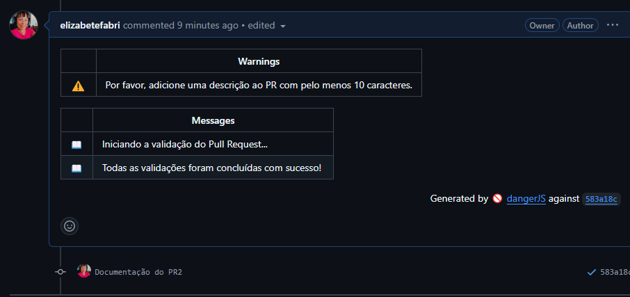

# Documentação do PR-1: Atualização no README

## Descrição
Este PR adiciona uma validação com o Danger.js para garantir que todos os Pull Requests possuam uma descrição com pelo menos 10 caracteres. Caso contrário, é emitido um aEste Pull Request adiciona e configura o Danger.js para realizar validações automatizadas durante o processo de revisão de código no repositório.

### Principais mudanças
- Configuração do Danger.js por meio do arquivo dangerfile.js com as seguintes validações:
- Emitir um Warning caso a descrição do PR tenha menos de 10 caracteres.
- Exibir mensagens no painel para indicar o início e a conclusão das validações.
- Integração com o GitHub Actions para execução automatizada do Danger.js.
- Adição de mensagens informativas para facilitar a revisão.

**Código**:
```javascript
if (danger.github.pr.body.length < 10) {
  warn('Please include a description of your PR changes.');
}

// Adiciona mensagens no painel
message('Iniciando a validação do Pull Request...');
// Outras validações...
message('Todas as validações foram concluídas com sucesso!');
```
### Please include a description of your PR changes.

### Descrição inserida.

### Regra passou com sucesso!

#### Links Úteis
npx danger pr https://github.com/elizabetefabri/danger-js/pull/1