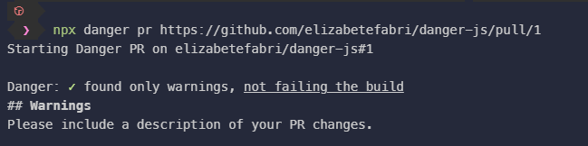
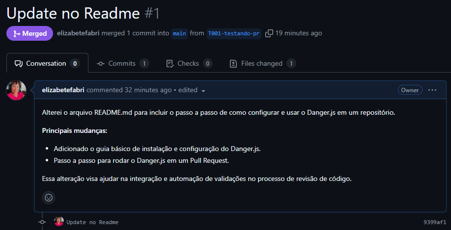
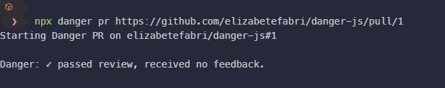

# Documentação do PR-1: Atualização no README

## Descrição
Este PR adiciona uma validação com o Danger.js para garantir que todos os Pull Requests possuam uma descrição com pelo menos 10 caracteres. Caso contrário, é emitido um aviso pedindo para incluir uma descrição detalhada.

## Regras de Danger.js aplicadas
### Regra 1
**Código**:
```javascript
if (danger.github.pr.body.length < 10) {
  warn('Please include a description of your PR changes.');
}
```
### Please include a description of your PR changes.

### Descrição inserida.

### Regra passou com sucesso!

#### Links Úteis
npx danger pr https://github.com/elizabetefabri/danger-js/pull/1