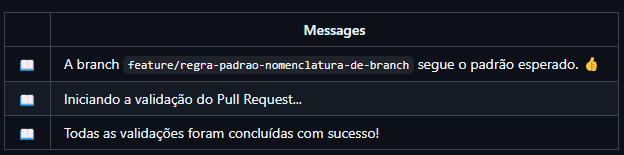

# Documentação do PR-3: Validação de Nome da Branch

## Descrição
Este PR adiciona uma validação com o Danger.js para garantir que as branches de origem sigam um padrão de nomenclatura específico, como feature/ e hotfix/. Essa validação automatizada ajuda a manter uma estrutura consistente e organizada no repositório.

### Principais mudanças
- Configuração do Danger.js para verificar se a branch de origem segue o padrão de nomenclatura esperado.
- Adição de uma validação no arquivo dangerfile.js para emitir mensagens de erro caso o padrão não seja respeitado.
- Exibição de mensagens informativas no painel para o início e conclusão das validações.
- Integração com o GitHub Actions para execução automatizada durante os Pull Requests.


**Código**:
```javascript
const { danger, fail, message } = require('danger');

// Adiciona mensagens no painel
message('Iniciando a validação do Pull Request...');

// Lista de padrões permitidos para o nome da branch
const validBranchPatterns = [/^feature\//, /^hotfix\//];

// Verifica se a branch de origem segue os padrões permitidos
const branchName = danger.github.pr.head.ref;
const isValidBranch = validBranchPatterns.some((pattern) => pattern.test(branchName));

if (!isValidBranch) {
  fail(`O nome da branch "${branchName}" não segue o padrão esperado. 
  Use "feature/" ou "hotfix/" como prefixo.`);
}

// Mensagem de conclusão
message('Todas as validações foram concluídas com sucesso!');

```
## Passo a passo
1. Alterações realizadas:
Adicionado código para validação do nome da branch no dangerfile.js.
Configurado para emitir um erro caso o nome da branch não comece com feature/ ou hotfix/.

2. Pipeline de CI/CD:
A integração foi feita via GitHub Actions, com um arquivo YAML de workflow configurado para executar o Danger.js automaticamente em cada Pull Request.
### Imagens das mensagens inseridas

#### Links Úteis
npx danger pr https://github.com/elizabetefabri/danger-js/pull/4